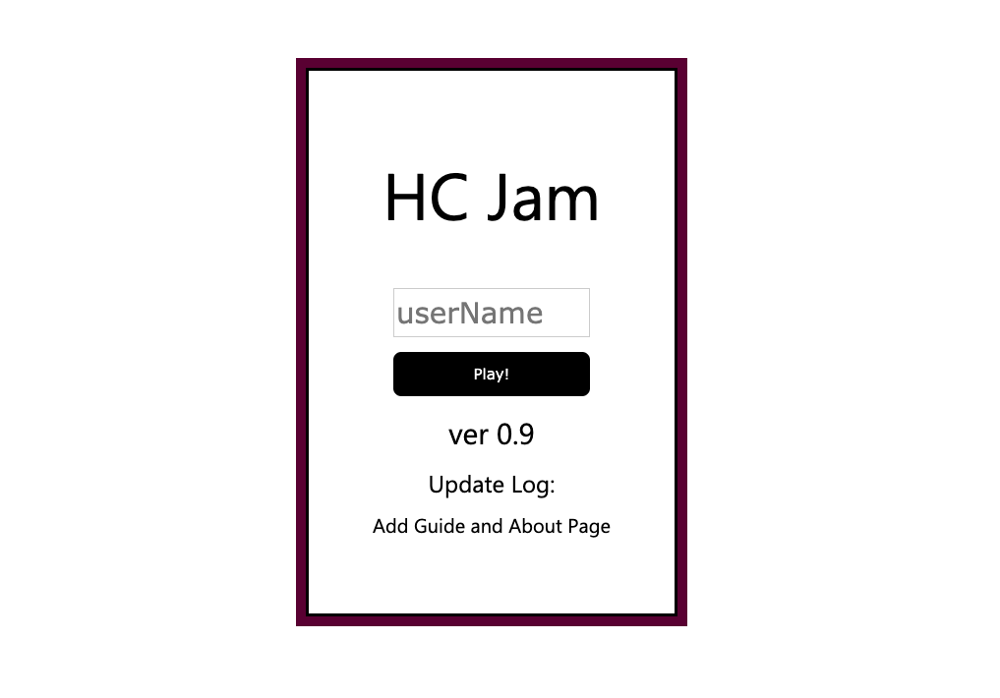
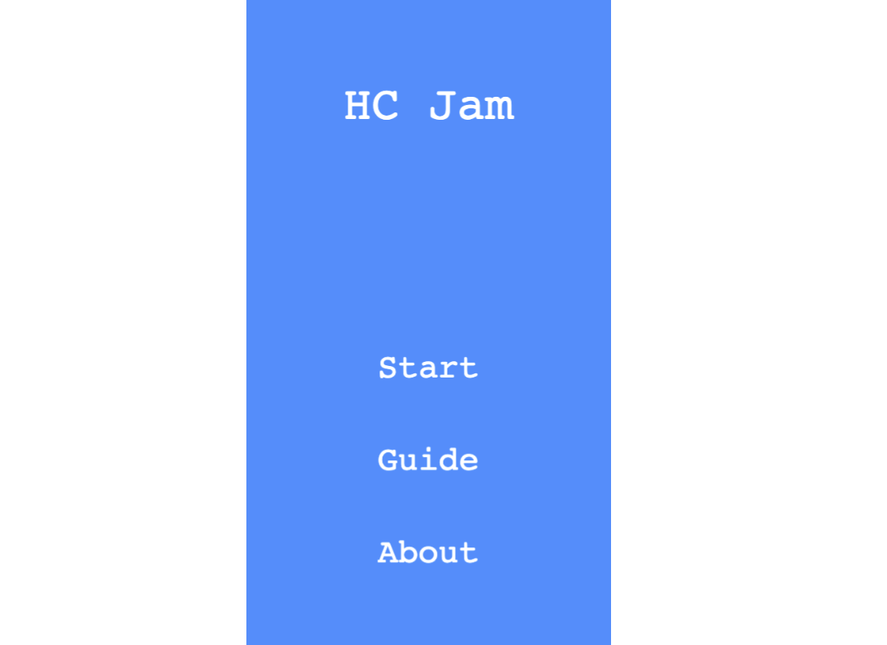
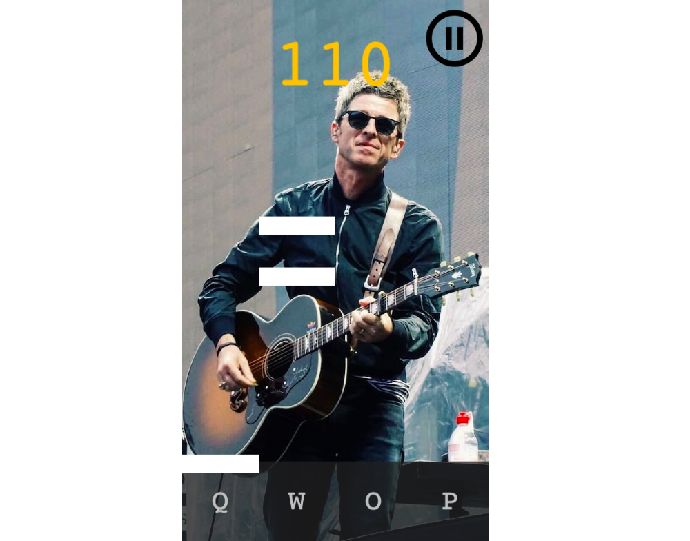
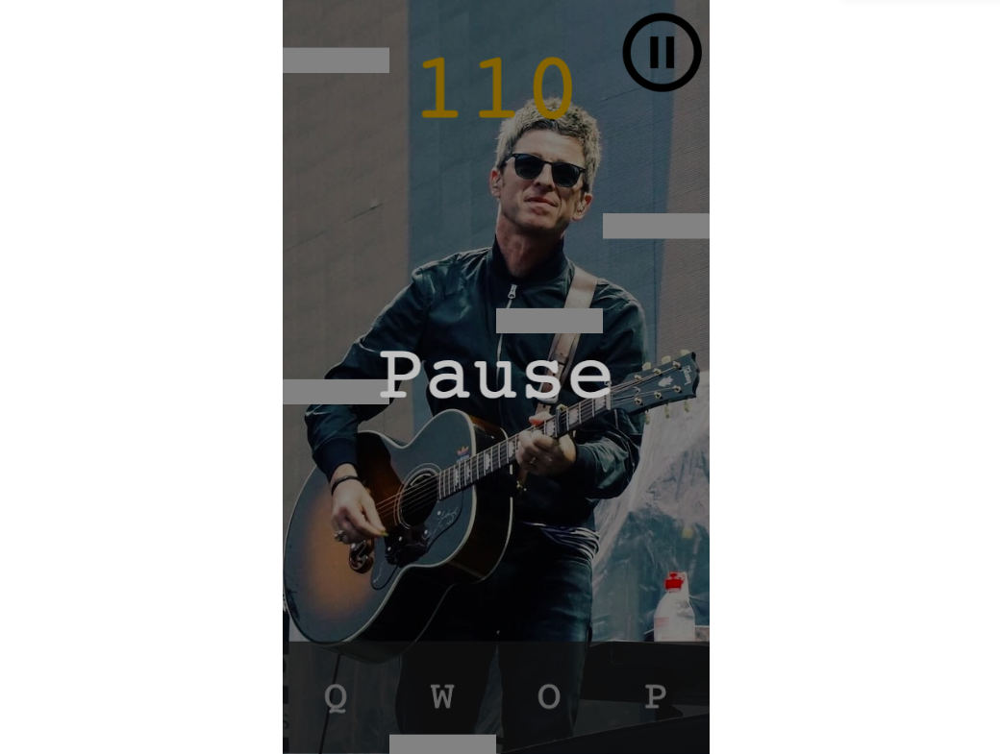
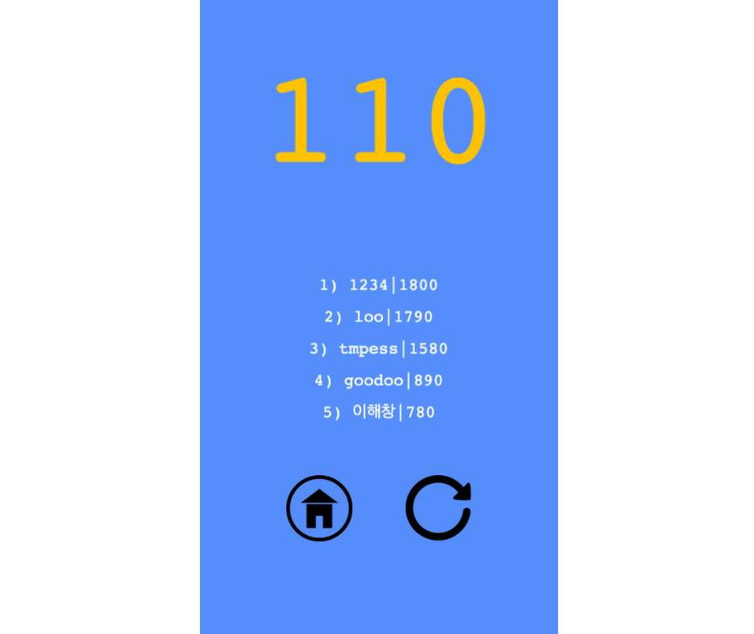

# HC_RhythmGame
-------------
## 1. 목차
```
.HC_RhythmGame
├── 1.목차
├── 2.개요
├── 3.사용법
|   ├── 3.1.개발 언어
|   └── 3.2.실행 방법
|       ├── 3.2.1 실행 환경 세팅
|       └── 3.2.2 실행
└── 4.실행 사진
    ├── 4.1.Login 화면
    ├── 4.2.Title 화면
    ├── 4.3.Play 화면
    ├── 4.4.Pause 화면
    └── 4.5.GameOver 화면
```


## 2. 개요
 - **Phaser.js(ver.3)** 로 개발된 **간단한 웹 리듬 게임**입니다. 한곡의 노래를 1절만 플레이할 수 있습니다.
 - This is a **Simple Web Rhythm Game** developed as a phaser.js(ver.3).


## 3. 사용법
### 3.1. 개발 언어 & 기술
- Language & Framework : Node.js / Phaser.js(ver.3)
- DB : MySQL


### 3.2. 실행 방법
#### 3.2.1 실행환경 세팅
```
# 1. node.js와 MySQL 설치
# 2. MySQL에 "rhythmGame_data" 스키마 생성 / 해당 스키마에서 "db_qeury.sql" 실행 (테이블 생성과 컬럼 추가)
# 3. server.js 파일을 에디터로 열고 본인의 MySQL user와 password 값 입력.
# 4. 터미널을 열고 이 프로젝트가 있는 경로로 들어가서 "npm install" 입력 후 실행 (node 실행을 위한 module들 설치) 
# 5. 잠시 후 module 설치가 다 끝난다면 실행환경 세팅 완료. 
```
#### 3.2.2 실행
```
# 1. 터미널에서 이 프로젝트가 있는 경로로 들어가서 "node server.js" 를 입력
# 2. 서버가 실행됐다는 알림이 뜨면 웹 브라우저의 주소창에 "localhost:8081" 입력
# 3. 게임 실행.
```


## 4. 실행 사진
### 4.1. Login 화면
 
 -------------

### 4.2. Title 화면
 
 -------------
 
### 4.3. Play 화면
 
 -------------
 
### 4.4. Pause 화면
 
 -------------
 
### 4.5. GameOver 화면
 
 -------------
